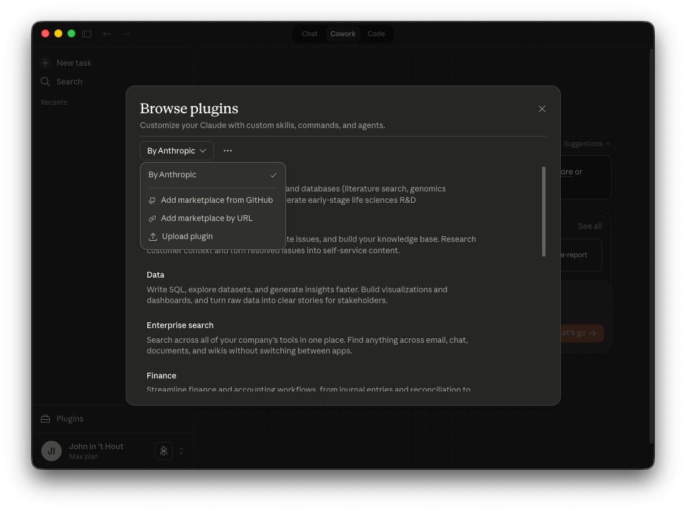

# Belastingadviseur Plugin

[](https://buymeacoffee.com/johnovate)

A bilingual Dutch tax workflow plugin for [Cowork](https://claude.com/product/cowork) and Claude Code.
It supports full-spectrum Netherlands tax operations for **particulier, ZZP, and BV** use cases.

> **Important**:
> This plugin supports tax workflows, not legal or fiscal advice.
> All outputs must be reviewed by a qualified Dutch tax professional before filing, payment, objection, or legal submission.

## Installation

1. Download the latest `.zip` from [GitHub Releases](https://github.com/johnhout/knowledge-work-belastingzaken/releases).
2. Open **Claude** and navigate to **Cowork** > **Plugins**.
3. Click the **"..."** menu and select **"Upload plugin"**.
4. Select the downloaded zip file.



## Commands

| Command | Description |
|---------|-------------|
| `/belastingadviseur:intake` | Intake and dossier setup for taxpayer profile, obligations, and missing documents |
| `/belastingadviseur:tax-calendar` | Build a verified tax deadline calendar for the selected year/profile |
| `/belastingadviseur:ib-aangifte` | Prepare inkomstenbelasting workflow (box 1/2/3 context, checks, and filing readiness) |
| `/belastingadviseur:btw-aangifte` | Prepare and check BTW return workflow for monthly/quarterly/annual obligations |
| `/belastingadviseur:vpb-aangifte` | Prepare vennootschapsbelasting workflow and pre-filing control checklist |
| `/belastingadviseur:loonheffingen` | Prepare payroll tax workflow (loonheffing, wage tax, social contributions, WKR checks) |
| `/belastingadviseur:aftrekcheck` | Validate relevant deductions, credits, and scheme eligibility with evidence checklist |
| `/belastingadviseur:bezwaar-brief` | Draft a Dutch bezwaar letter template with legal references and deadline controls |

## Skills

| Skill | Description |
|-------|-------------|
| `belasting-intake-en-dossiervorming` | Intake framework, document requests, taxpayer segmentation, and dossier quality controls |
| `inkomstenbelasting-boxen` | Box-based IB workflow (box 1/2/3), evidence mapping, and risk checks |
| `omzetbelasting-btw` | VAT period handling, output/input VAT checks, ICP logic, and correction flows |
| `vennootschapsbelasting-vpb` | Corporate tax workflow, fiscal profit bridge, and supporting schedules |
| `loonheffingen-en-werkkosten` | Payroll tax filing workflow including WKR, payroll evidence, and periodic controls |
| `aftrekposten-en-regelingen` | Deduction and allowance qualification workflow for individuals and businesses |
| `bezwaar-en-correspondentie` | Objection structure, argument mapping, and correspondence quality standards |
| `officiele-bronverificatie` | Mandatory verification protocol for rates, dates, thresholds, and legal references |

## Official Source Policy

This plugin enforces an official-source-first policy before any date/rate/threshold/legal claim:

1. Verify against `belastingdienst.nl` and/or `wetten.overheid.nl`.
2. Cite exact URL and retrieval date (`YYYY-MM-DD`) in output.
3. If verification is unavailable, explicitly mark the item as **not verified** and do not present it as final.

## Connectors

If placeholders like `~~boekhouding` or `~~data warehouse` appear, see [CONNECTORS.md](CONNECTORS.md).

## Example Prompts

Each command below can be tested with the included test data files.

### Intake — ZZP client onboarding

```
/belastingadviseur:intake zzp 2025
```
Upload `klanten.csv`. Builds a complete dossier for Jan de Vries (ZZP) with obligations, missing documents, and risk flags.

### Tax Calendar — BV annual planning

```
/belastingadviseur:tax-calendar 2025 bv
```
Upload `klanten.csv`. Generates a verified deadline calendar for Bakkerij Broodjes BV covering BTW, VPB, and loonheffingen filing dates.

### IB Aangifte — Individual income tax

```
/belastingadviseur:ib-aangifte 2025 particulier
```
Upload `particulier_maria_inkomsten_2025.csv` and `particulier_maria_box3_2025.csv`. Walks through box 1 (salary, eigen woning, partner), box 3 (vermogen incl. crypto), and checks completeness.

### BTW Aangifte — Quarterly VAT return

```
/belastingadviseur:btw-aangifte 2025-Q2 zzp
```
Upload `zzp_pieter_btw_q2_2025.csv`. Processes Q2 VAT including ICP transactions (DE, BE, CH), reverse-charge, and open invoices.

### VPB Aangifte — Corporate income tax

```
/belastingadviseur:vpb-aangifte 2025
```
Upload `bv_broodjes_resultatenrekening_2025.csv`. Builds the fiscal profit bridge from commercial result to taxable profit with supporting schedules.

### Loonheffingen — Monthly payroll tax

```
/belastingadviseur:loonheffingen 2025-01
```
Upload `bv_broodjes_loonheffingen_2025_jan.csv`. Reviews payroll for 8 employees including WKR checks, contract types, and periodic reconciliation.

### Aftrekcheck — Deduction eligibility

```
/belastingadviseur:aftrekcheck 2025 zzp
```
Upload `zzp_jan_boekhouding_2025.csv`. Validates zelfstandigenaftrek, MKB-winstvrijstelling, investeringsaftrek (KIA), and other applicable deductions with evidence checklist.

### Bezwaar Brief — Tax objection letter

```
/belastingadviseur:bezwaar-brief inkomstenbelasting 2025-12-15
```
No test data file needed — provide assessment details and factual grounds interactively. Drafts a formal objection letter with legal references and deadline controls.

## Example Workflows

### Yearly intake and planning

1. Run `/belastingadviseur:intake zzp 2025`.
2. Run `/belastingadviseur:tax-calendar 2025 zzp`.
3. Confirm missing documents and filing responsibilities.

### Periodic VAT cycle

1. Run `/belastingadviseur:btw-aangifte 2025-Q1 zzp`.
2. Validate input/output VAT evidence.
3. Track risks and follow-up actions before filing.

### Objection preparation

1. Run `/belastingadviseur:bezwaar-brief inkomstenbelasting 2026-02-05`.
2. Add assessment details and factual grounds.
3. Validate legal references and submission timing.

## Testdata

De map `testdata/` bevat dummy CSV-bestanden om de plugin mee te testen.

| Bestand | Klant | Te testen met |
|---------|-------|---------------|
| `klanten.csv` | Alle 5 klanten | `/belastingadviseur:intake` — klantprofielen voor zzp, bv en particulier |
| `zzp_jan_boekhouding_2025.csv` | Jan de Vries (ZZP) | `/belastingadviseur:ib-aangifte`, `/belastingadviseur:btw-aangifte`, `/belastingadviseur:aftrekcheck` |
| `zzp_pieter_btw_q2_2025.csv` | Pieter Bakker (ZZP) | `/belastingadviseur:btw-aangifte` — bevat ICP (DE, BE, CH), verlegd en openstaande facturen |
| `bv_broodjes_resultatenrekening_2025.csv` | Bakkerij Broodjes BV | `/belastingadviseur:vpb-aangifte` — volledige resultatenrekening voor fiscale winstbepaling |
| `bv_broodjes_btw_q1_2025.csv` | Bakkerij Broodjes BV | `/belastingadviseur:btw-aangifte` — Q1 verkoop- en inkoopfacturen met ICP-inkoop |
| `bv_broodjes_loonheffingen_2025_jan.csv` | Bakkerij Broodjes BV | `/belastingadviseur:loonheffingen` — 8 werknemers, diverse contractvormen en WKR |
| `particulier_maria_inkomsten_2025.csv` | Maria Jansen (particulier) | `/belastingadviseur:ib-aangifte` — salaris, eigen woning, fiscaal partner, giften |
| `particulier_maria_box3_2025.csv` | Maria Jansen (particulier) | `/belastingadviseur:ib-aangifte` — box 3 vermogen incl. crypto en tweede woning |

## Configuration

Edit `.mcp.json` to align with your connected stack.
Keep legal/tax authority verification on official Dutch sources only.
